# Azure Honeypot SIEM Lab

---

## 🧭 Overview

This project documents the setup of a honeypot in Microsoft Azure, with real-time log forwarding to Microsoft Sentinel. It explores the detection of brute-force attacks using KQL, geo-IP enrichment, and heatmap visualization to identify attacker origins and behavior.

---

## ⚙️ Step 1: Azure Environment Setup

### Fresh Azure Dashboard  
[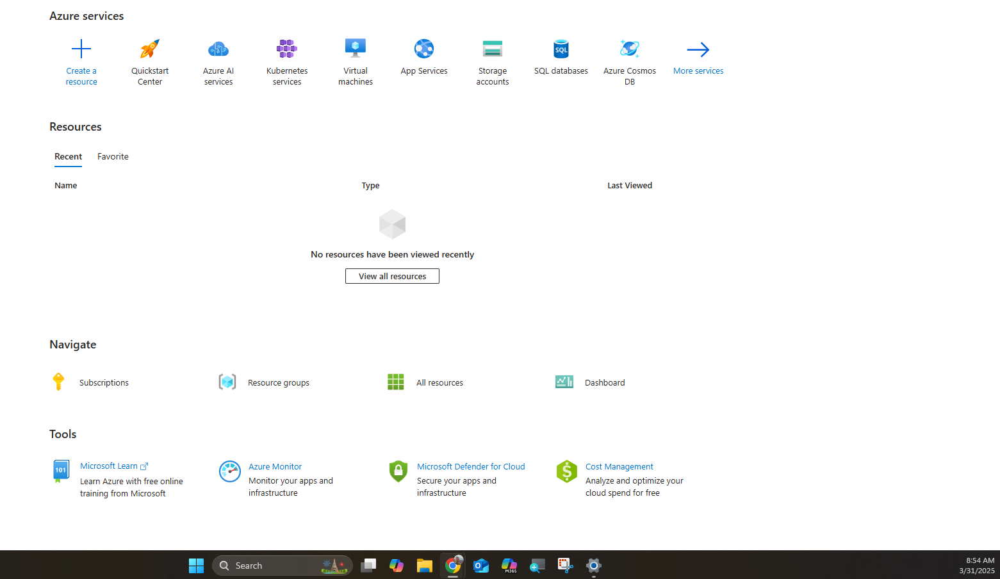](./images/2_Fresh_dashboard.png)

### Created Resource Group  

### VNet Created  
[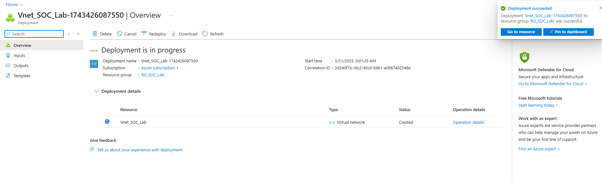](./images/4_Vnet_deployed.png)

---

## 🖥️ Step 2: Deploying the Honeypot VM

### Windows VM Deployed  
[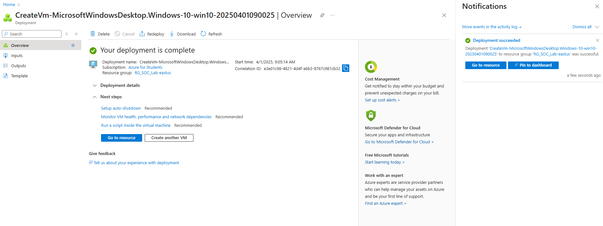](./images/5_WindowsVM_created.png)

### NSG Firewall Rule Opened  
[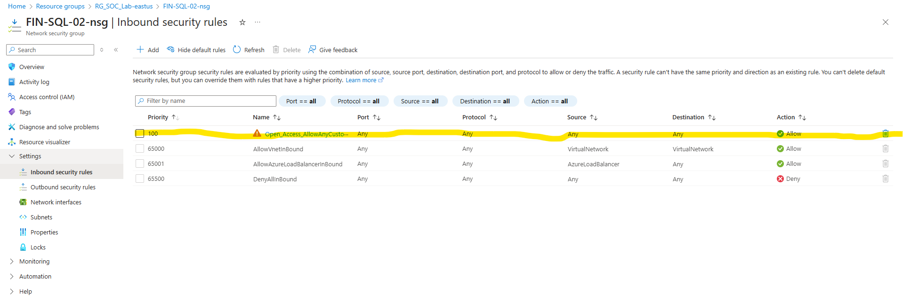](./images/7_NSG_inboundrules.png)

### Windows Firewall Disabled  
[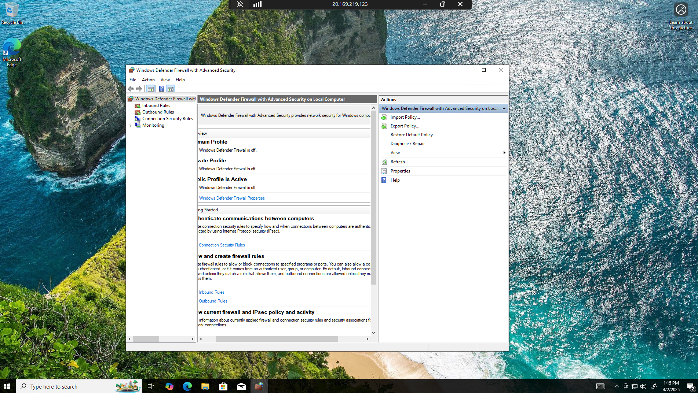](./images/9_WindowsVM_firewall_off.png)

### Remote Desktop into VM  

---

## 🛡️ Step 3: Simulating Attacks and Observing Logs

### Simulated Login Failures  

### Logs Capturing Real-World Brute Force  
[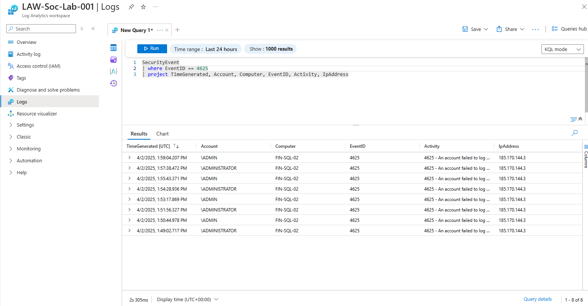](./images/23_eventID_4625_filtered.png)

---

## 📊 Step 4: Log Forwarding to Microsoft Sentinel

### Log Analytics Workspace Created  
[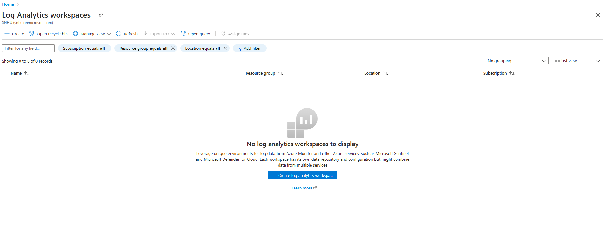](./images/13_Workspace_created.png)

### Microsoft Sentinel Added  

### Azure Monitor Agent Deployed  
[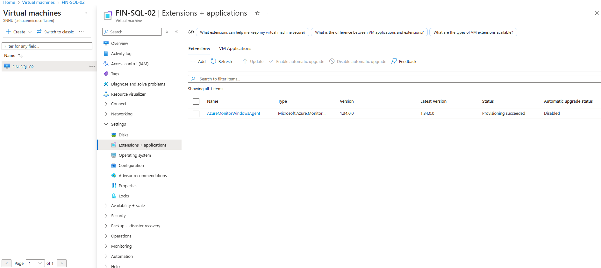](./images/19_Monitor_agent_deployed.png)

### Security Event Data Visible  

---

## 🌍 Step 5: Enriching Logs with GeoIP Data

### GeoIP CSV Uploaded as Watchlist  

### Enrichment Query Run with KQL  
[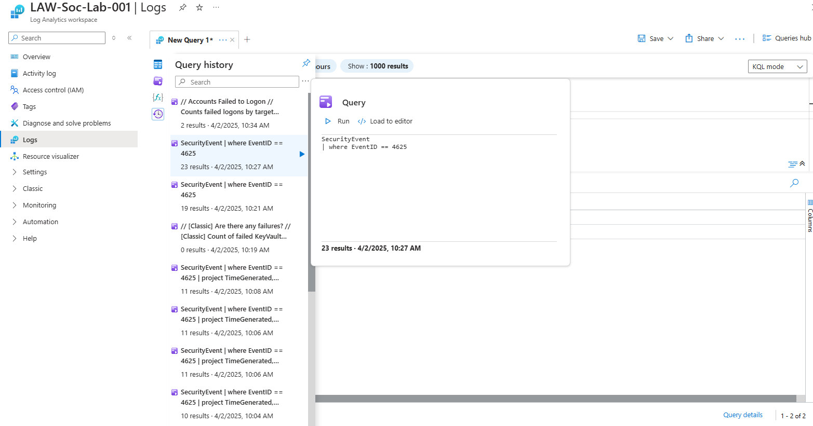](./images/24_KQL_Queries_ran.png)

---

## 🗺️ Step 6: Visualizing Attacks on Heatmap

### Heatmap Display of Attacker Origins  
[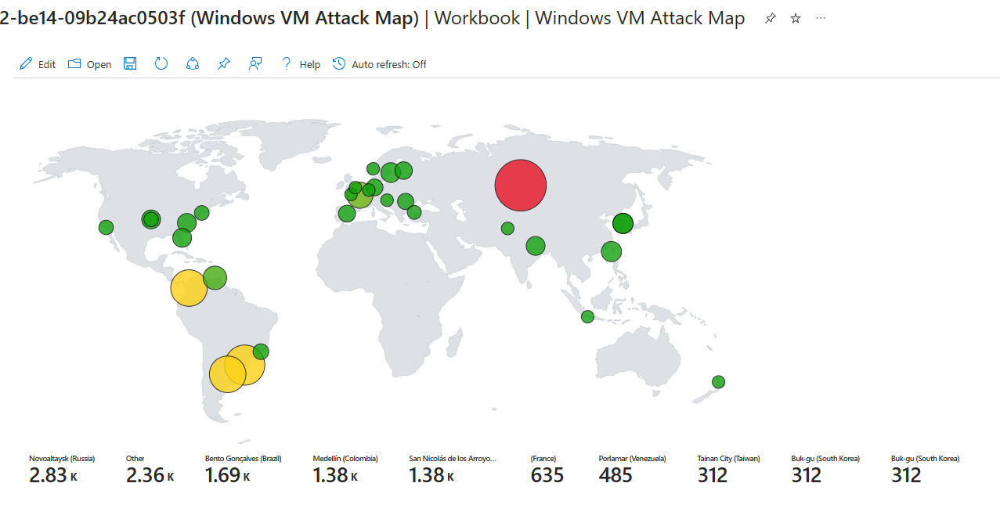](./images/27_HeatMap_after_24hrs.png)

---

## 🧑‍💻 Step 7: Most Common Usernames Attacked

### Top 20 Targeted Usernames  
[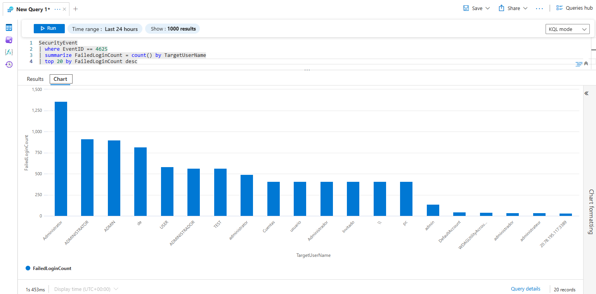](./images/29_Query_top_username_attempts.png)

---

## ✅ Summary

Setting up this honeypot gave me hands-on experience in log collection, analysis, and visualization using Microsoft Sentinel. The lab clearly demonstrated how fast a vulnerable VM can be discovered and targeted. It reinforced the importance of basic security practices like closing ports and firewall hardening—and the power of modern SIEM tools.

This project also helped sharpen my skills in:
- 🛠️ Azure Virtual Machines & Networking
- 🛡️ Microsoft Sentinel and Log Analytics
- 🔎 KQL (Kusto Query Language)
- 🌐 GeoIP enrichment & Watchlists
- 📈 Visual threat tracking with Workbooks

---

---

