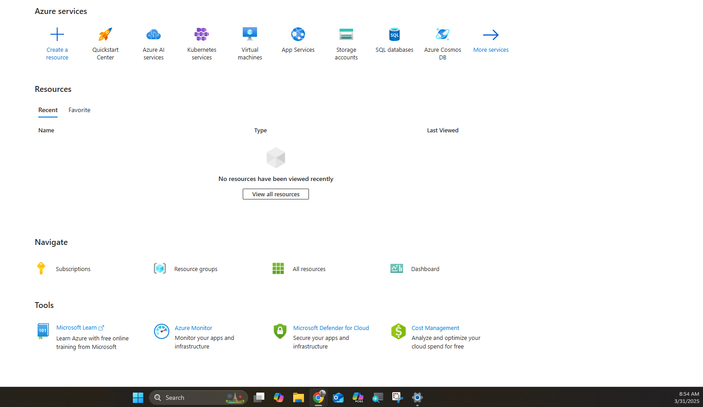
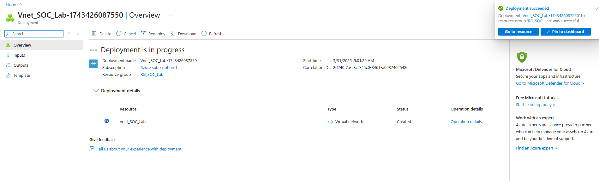

# Azure Honeypot + SIEM Lab

[](./Azure_Honeypot_SIEM_Lab_Report.pdf)

## Overview

This project documents the planning and deployment of a **Windows honeypot in Microsoft Azure**, with centralized log forwarding to **Microsoft Sentinel**. The goal was to simulate malicious login attempts and visualize them using **KQL**, **GeoIP enrichment**, and **Sentinel workbooks**.

---

## Lab Architecture

- Windows 10 Pro VM (`FIN-SQL-02`) acting as a honeypot
- Microsoft Sentinel + Log Analytics Workspace
- KQL to analyze failed login attempts (Event ID 4625)
- Watchlist-based GeoIP lookups
- Global heatmap + dashboard in Sentinel

[](./images/1_Azure_Honeypot_Lab_Diagram.jpg)

---

## Setup Steps

### 1. Azure Environment Setup

Created a new **resource group**, virtual network, and set up the Azure dashboard.

[](./images/2_Fresh_dashboard.png)  
[](./images/3_Created_resource_group.png)  
[](./images/4_Vnet_deployed.png)

---

### 2. Deploying the Honeypot VM

Created a Windows VM with a finance-sounding name `FIN-SQL-02` and allowed **all inbound traffic** via the NSG. Disabled the Windows firewall.

[](./images/5_WindowsVM_created.png) 
[](./images/6_VM_deployed.png)
[](./images/6_NSG_firewall.png) 
[](./images/8_Remote_in_desktop.png)  
[](./images/9_WindowsVM_firewall_off.png)
[](./images/10_Pingtest_to_VM.png)

---

### 3. Simulating Attacks and Viewing Logs

Used RDP to intentionally fail logins. Event Viewer immediately showed Event ID **4625** for failed attempts. Logs showed real brute-force attempts almost immediately.

[](./images/11_VM_login_test_fail.png)  
[](./images/12_VM_longin_test_fail_results.png)

---

### 4. Log Forwarding to Sentinel

Created a **Log Analytics Workspace**, connected **Microsoft Sentinel**, and installed the **Azure Monitor Agent**.

[](./images/13_Workspace_created.png)  
[](./images/14_Log_analytics_WS_created.png)  
[](./images/16_Sentinel_landingpage.png)  
[](./images/17_Windows_security_events.png)
[](./images/18_Connected_security_events_to_monitor_agent.png)
[](./images/19_Collection_rule_to_send_to_sentinel.png)
[](./images/19_Monitor_agent_deployed.png)
[](./images/20_Logs_collecting.png)

---

### 5. Enriching Logs with GeoIP

Uploaded `geoip-summarized.csv` as a **Watchlist** and used the `ipv4_lookup()` function in KQL to identify geographic sources of attacks.

[](./images/24_Sentinel_watchlist_geodata.png)
[](./images/26_GeoIP_data_upload_success.png)  

---

### 6. Visualizing the Attacks

Created a **Sentinel Workbook** and global **heatmap** for login attempts.

[](./images/27_HeatMap_generated.png) 
[](./images/27_HeatMap_after_24hrs.png)  

JSON text for map configuration
```JSON map configuration
{
	"type": 3,
	"content": {
	"version": "KqlItem/1.0",
	"query": "let GeoIPDB_FULL = _GetWatchlist(\"geoip\");\nlet WindowsEvents = SecurityEvent;\nWindowsEvents | where EventID == 4625\n| order by TimeGenerated desc\n| evaluate ipv4_lookup(GeoIPDB_FULL, IpAddress, network)\n| summarize FailureCount = count() by IpAddress, latitude, longitude, cityname, countryname\n| project FailureCount, AttackerIp = IpAddress, latitude, longitude, city = cityname, country = countryname,\nfriendly_location = strcat(cityname, \" (\", countryname, \")\");",
	"size": 3,
	"timeContext": {
		"durationMs": 2592000000
	},
	"queryType": 0,
	"resourceType": "microsoft.operationalinsights/workspaces",
	"visualization": "map",
	"mapSettings": {
		"locInfo": "LatLong",
		"locInfoColumn": "countryname",
		"latitude": "latitude",
		"longitude": "longitude",
		"sizeSettings": "FailureCount",
		"sizeAggregation": "Sum",
		"opacity": 0.8,
		"labelSettings": "friendly_location",
		"legendMetric": "FailureCount",
		"legendAggregation": "Sum",
		"itemColorSettings": {
		"nodeColorField": "FailureCount",
		"colorAggregation": "Sum",
		"type": "heatmap",
		"heatmapPalette": "greenRed"
		}
	}
	},
	"name": "query - 0"
}
```

---

### 7. Target Username Analysis

Queried the top usernames targeted and location by attackers using KQL.

[](./images/29_Query_top_username_attempts.png)

```kql
SecurityEvent
| where EventID == 4625
| summarize FailedLoginCount = count() by TargetUserName
| top 20 by FailedLoginCount desc
```

[](./images/28_Query_top_country_attacks.png)

```kql
let GeoIPDB_FULL = _GetWatchlist("geoip");
SecurityEvent
| where EventID == 4625
| summarize FailedLoginCount = count() by IpAddress
| top 10 by FailedLoginCount desc
| evaluate ipv4_lookup(GeoIPDB_FULL, IpAddress, network)
| project IpAddress, cityname, countryname, latitude, longitude, FailedLoginCount
```

---

## Final Testing

- Confirmed successful log ingestion to Sentinel  
- Real-world attackers were actively probing within **minutes**  
- Visualizations and heatmaps provided valuable SOC insight  
- Honeypot operated safely in isolated test environment  

---

## Summary

This lab was a deep-dive into:
- Honeypot deployment
- Cloud-based threat visibility
- KQL-based log analysis
- SOC-level visualization using Microsoft Sentinel

It provided practical blue team experience and reaffirmed the importance of log centralization and global attack visibility.

[](./Azure_Honeypot_SIEM_Lab_Report.pdf)
