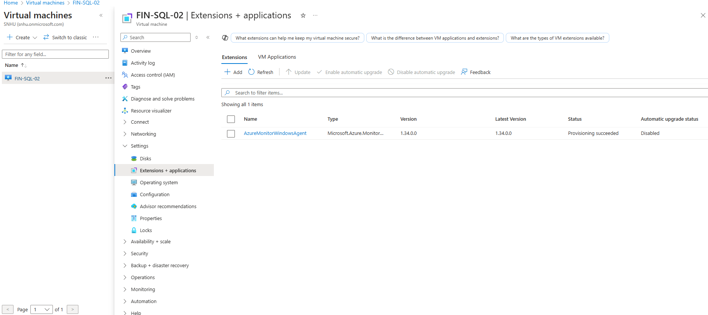

# Azure Honeypot + SIEM Lab

[](./Azure_Honeypot_SIEM_Lab_Report.pdf)

## Overview

This project documents the planning and deployment of a **Windows honeypot in Microsoft Azure**, with centralized log forwarding to **Microsoft Sentinel**. The goal was to simulate malicious login attempts and visualize them using **KQL**, **GeoIP enrichment**, and **Sentinel workbooks**.

---

## Lab Architecture

- Windows 10 Pro VM (`FIN-SQL-02`) acting as a honeypot
- Microsoft Sentinel + Log Analytics Workspace
- KQL to analyze failed login attempts (Event ID 4625)
- Watchlist-based GeoIP lookups
- Global heatmap + dashboard in Sentinel

[](./images/1_ProjectTo_VM.png)

---

## Setup Steps

### 1. Azure Environment Setup

Created a new **resource group**, virtual network, and set up the Azure dashboard.

[](./images/2_VM_login_test_failing.png)  
[](./images/3_VM_login_test_fail_results.png)  
[](./images/4_Log_analytics_WS_created.png)

---

### 2. Deploying the Honeypot VM

Created a Windows VM with a finance-sounding name `FIN-SQL-02` and allowed **all inbound traffic** via the NSG. Disabled the Windows firewall.

[](./images/6_NSG_firewall.png)  
[](./images/8_Remote_in_desktop.png)  
[](./images/9_WindowsVM_firewall_off.png)

---

### 3. Simulating Attacks and Viewing Logs

Used RDP to intentionally fail logins. Event Viewer immediately showed Event ID **4625** for failed attempts. Logs showed real brute-force attempts almost immediately.

[](./images/11_VM_login_test_fail_results.png)  
[](./images/12_VM_login_test_fail_results.png)

---

### 4. Log Forwarding to Sentinel

Created a **Log Analytics Workspace**, connected **Microsoft Sentinel**, and installed the **Azure Monitor Agent**.

[](./images/13_Workspace_created.png)  
[](./images/14_MAS_Sentinel_WS.png)  
[](./images/15_SentinelLandingpage.png)  
[](./images/19_Monitor_agent_deployed.png)

---

### 5. Enriching Logs with GeoIP

Uploaded `geoip-summarized.csv` as a **Watchlist** and used the `ipv4_lookup()` function in KQL to identify geographic sources of attacks.

[](./images/25_GeoIP_data_upload_success.png)  
[](./images/24_Sentinel_watchlist_geoipdata.png)

```kql
let GeoIPDB_FULL = _GetWatchlist("geoip");
SecurityEvent
| where EventID == 4625
| summarize FailedLoginCount = count() by IpAddress
| top 10 by FailedLoginCount desc
| evaluate ipv4_lookup(GeoIPDB_FULL, IpAddress, network)
| project IpAddress, cityname, countryname, latitude, longitude, FailedLoginCount
```

---

### 6. Visualizing the Attacks

Created a **Sentinel Workbook** and global **heatmap** for login attempts.

[](./images/27_Heatmap_after_24hrs.png)  
[](./images/29_GeoMap_top_country_attacks.png)

---

### 7. Target Username Analysis

Queried the top usernames targeted by attackers using KQL.

[](./images/30_GeoMap_top_username_attempts.png)

```kql
SecurityEvent
| where EventID == 4625
| summarize FailedLoginCount = count() by TargetUserName
| top 20 by FailedLoginCount desc
```

---

## Final Testing

- Confirmed successful log ingestion to Sentinel  
- Real-world attackers were actively probing within **minutes**  
- Visualizations and heatmaps provided valuable SOC insight  
- Honeypot operated safely in isolated test environment  

---

## Summary

This lab was a deep-dive into:
- Honeypot deployment
- Cloud-based threat visibility
- KQL-based log analysis
- SOC-level visualization using Microsoft Sentinel

It provided practical blue team experience and reaffirmed the importance of log centralization and global attack visibility.

[](./Azure_Honeypot_SIEM_Lab_Report.pdf)
