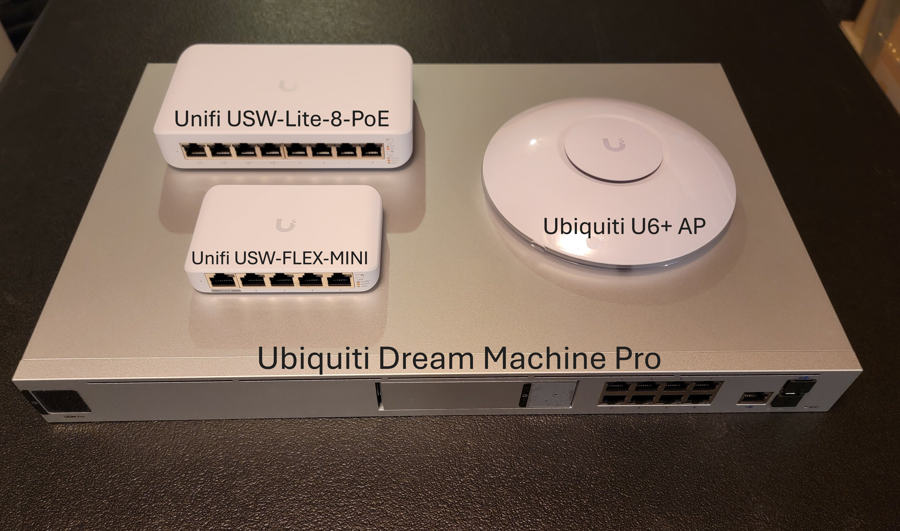
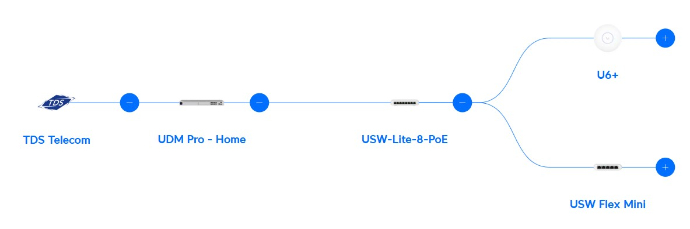
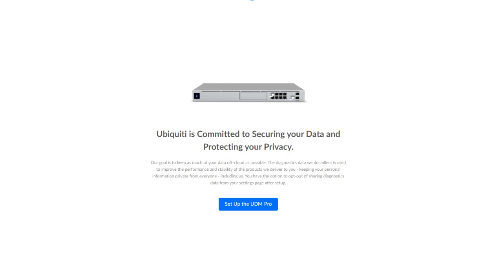
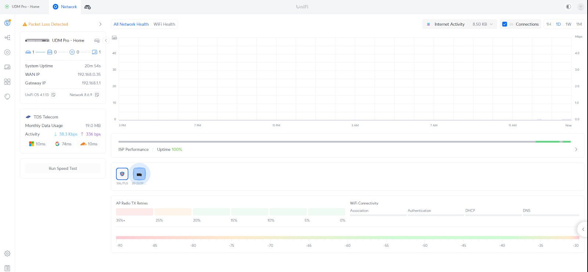
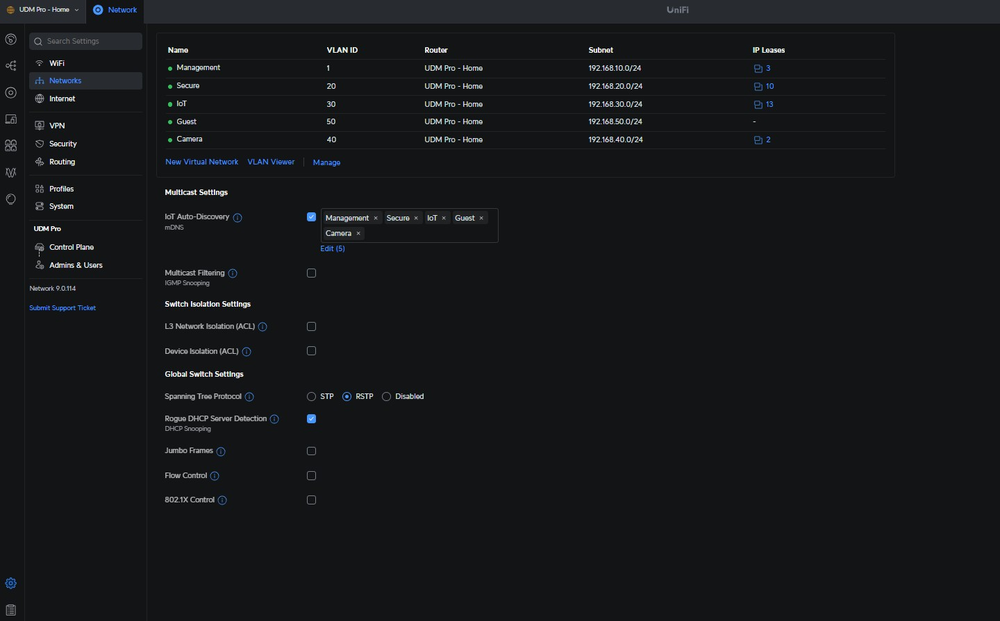
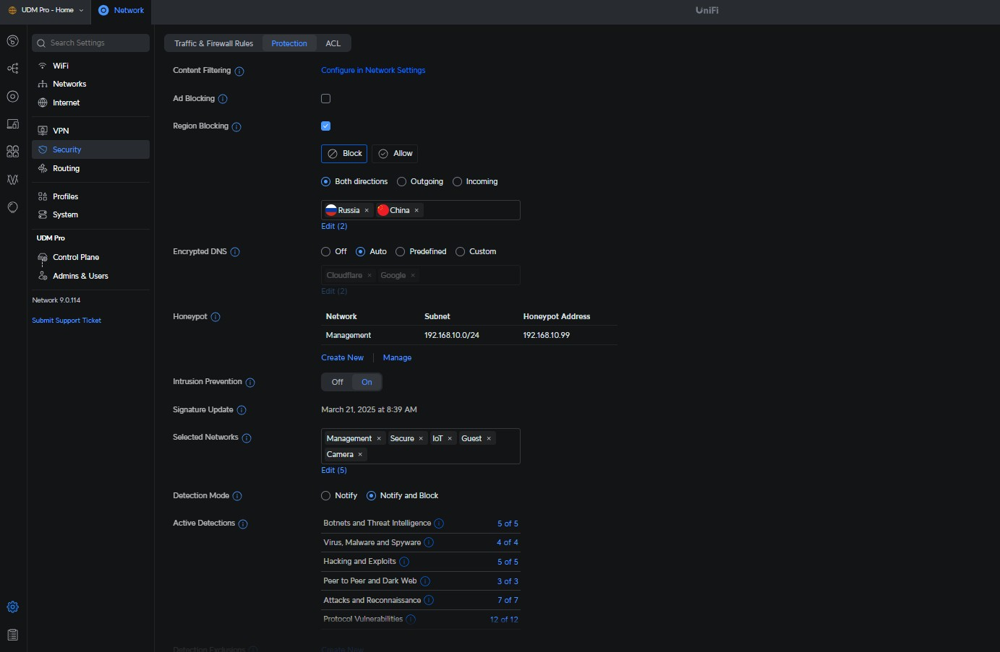
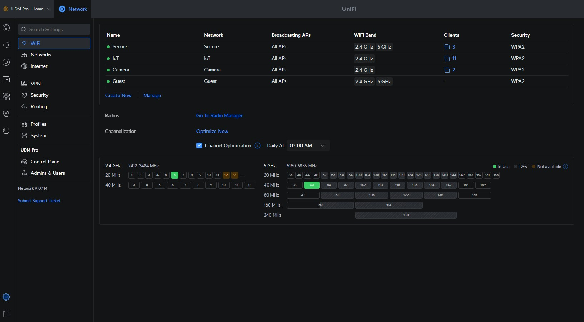
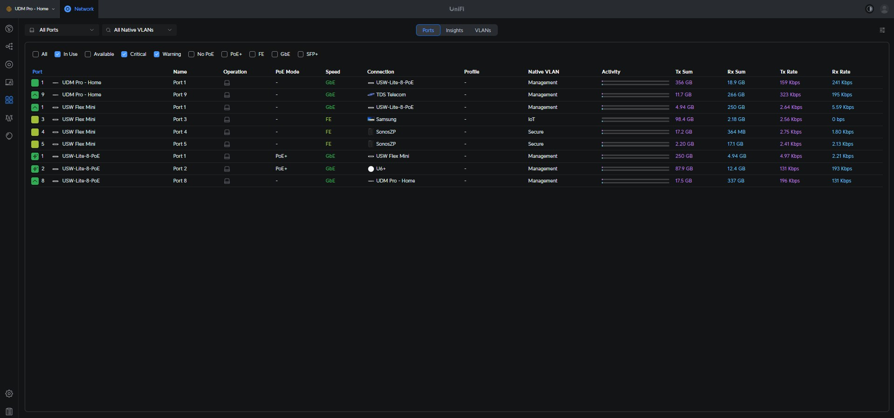
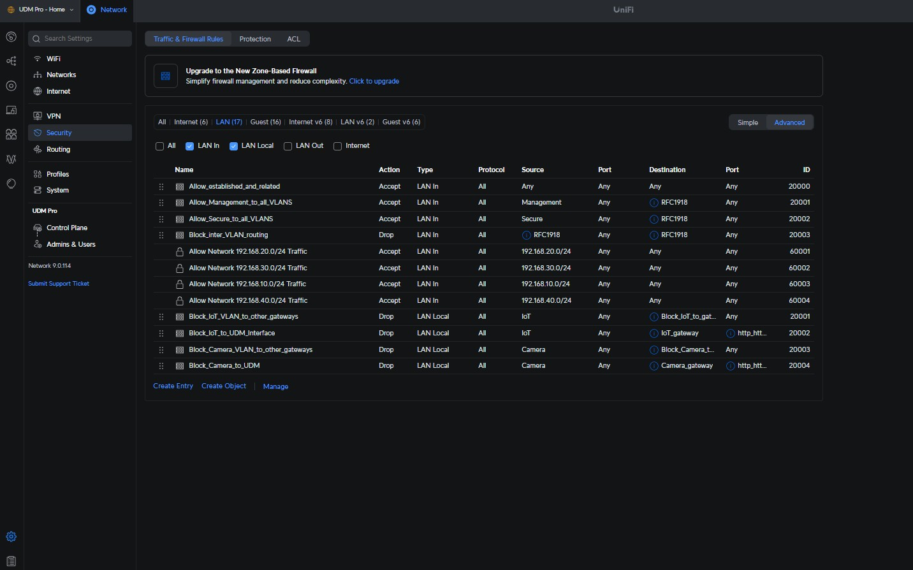

# Home Network Setup

## Overview
---

This project documents the planning, deployment, and configuration of a segmented home network using **Ubiquiti UniFi equipment**, with a focus on security, scalability, and network management.

The Ubiquiti Dream Machine Pro (UDMP), was selected as the main network device with its feature-rich capabilities:
- Application-layer firewall
- VLAN segmentation
- DHCP & DNS management
- IDS/IPS functionality
- VPN and remote access support
- Network video recorder (NVR) capability
- 10 GB throughput

---

## Equipment List

| Device                             | Purpose/Placement                                  | Notes                                      |
|------------------------------------|----------------------------------------------------|--------------------------------------------|
| ISP Modem/Router (Actiontec T3200) | Bridge Mode to UDM Pro                             | Used only to pass WAN to UDM               |
| UDM Pro                            | Gateway, Firewall, DNS/DHCP, Remote Admin          | Central brain of the network               |
| UniFi USW-Lite-8-PoE               | Main Switch + PoE                                  | Tagged VLANs (Secure, IoT, Camera, Guest)  |
| UniFi Flex Mini                    | Secondary PoE Switch for IoT                       | Tagged VLANs (Secure and IoT)              |
| UniFi U6+                          | Wireless Access Point                              | 4 SSIDs segmented by VLANs                 |
| 2x UPS                             | Backup Power                                       | Ensures uptime for core devices            |
| Cat6 Ethernet Cables               | Connect network devices                            | Supports up to 10 GB speeds                |

---

## VLAN Segmentation

| VLAN       | ID  | Subnet              | Devices                        | Notes                                      |
|------------|-----|---------------------|--------------------------------|--------------------------------------------|
| Management | 1  | 192.168.10.0/24     | Network infrastructure         | Isolated; no access from other VLANs       |
| Secure     | 20  | 192.168.20.0/24     | Phones, PCs, printer, scanner  | Full access across VLANs                   |
| IoT        | 30  | 192.168.30.0/24     | Smart TVs, plugs, appliances   | Internet only; casting allowed             |
| Camera     | 40  | 192.168.40.0/24     | IP cameras                     | Internet only; remote view enabled         |
| Guest      | 50  | 192.168.50.0/24     | Visitor devices                | Guest portal; limited casting to IoT only  |

---

## Firewall Configuration

| From → To         | Access                          |
|-------------------|---------------------------------|
| Management → All  | ✅ Full communication            |
| Secure → All      | ✅ Full communication            |
| IoT → Others      | ❌ Blocked (except casting)      |
| Guest → Secure    | ❌ Blocked                       |
| Guest → IoT       | ✅ Allowed (casting only)        |
| VLANs → Management| ❌ Blocked (except Secure VLAN)  |
| Gateways          | ❌ Blocked (except main and secure)|
| Kid devices       | 🕒📺 Time and content restrictions |

---

## Setup Steps

### 1. Connect Devices

All hardware was placed and connected. PoE powered Flex Mini and UniFi U6+. Devices connected and adopted in the controller.

Click image to enlarge:

---

## Network Topology

---

### 2. UDM Pro Initialization

Connected to ISP modem temporarily for setup and firmware updates:

  

---

### 3. UniFi GUI + Device Adoption

Logged into UniFi Controller, adopted and updated all devices.

---

### 4. VLAN + DHCP Setup

Created VLANs and assigned DHCP pools.

---

### 5. Security Hardening

- IDS/IPS Enabled  
- Country Blocking Applied  
- Honeypot Set in Management VLAN

---

### 6. Wireless SSID Configuration

Configured 4 SSIDs and tagged to appropriate VLANs:
- Secure (2.4 + 5 GHz, hidden)
- IoT (2.4 GHz, hidden)
- Camera (2.4 GHz, hidden)
- Guest (2.4 + 5 GHz, guest portal enabled)

---

### 7. Switch Port Configuration

Configured port-level VLAN tagging for added security.

---

### 8. Firewall Rules & Testing

Confirmed segmentation, tested with ping from VLAN to VLAN:

---

## Final Testing

- All VLAN rules verified
- Internet access confirmed for isolated networks
- Casting functions validated
- Guest SSID secured with portal + isolation
- Kid device firewall rules for time/content filtering

---

## Summary

This project was carried out with an interest in further securing home environments, practicing enterprise-level concepts, and a basis to allow for implementing future home lab projects.  

---
